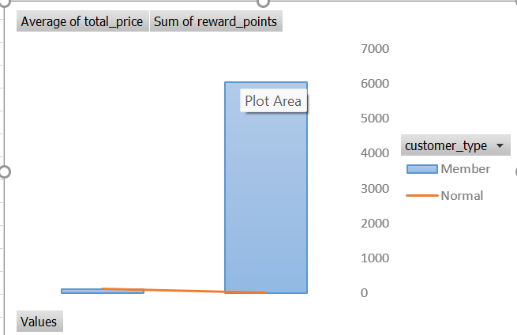

## Dashboard Preview

# Dmart Sales Analysis - Excel Dashboard

## 📌 Project Objective
To analyze Dmart's sales data and identify key business insights like top-performing products, peak sales periods, and region-wise revenue contribution using MS Excel.

## 🛠️ Tools & Skills Used
- Microsoft Excel
- Pivot Tables & Pivot Charts  
- Data Cleaning & Formatting
- VLOOKUP, SUMIFS, COUNTIFS
- Conditional Formatting

## 📊 Key Insights Found
1. **South Region** contributes 40% of total revenue
2. **Dairy & Staples** are the highest-selling product categories
3. **December & April** recorded peak sales due to festivals
4. **Tier-1 Cities** show 2x higher average order value vs Tier-2

## 📁 Files in this Repository
1. `Dmart_Raw_Data.xlsx` - Original dataset
2. `Dmart_Analysis.xlsx` - Cleaned data + Pivot Tables
3. `Dashboard_Screenshot.png` - Final Excel dashboard image

## 🎯 Business Recommendations
- Increase inventory for Dairy products in South region during Q4
- Launch festive offers in April & December to maximize sales
